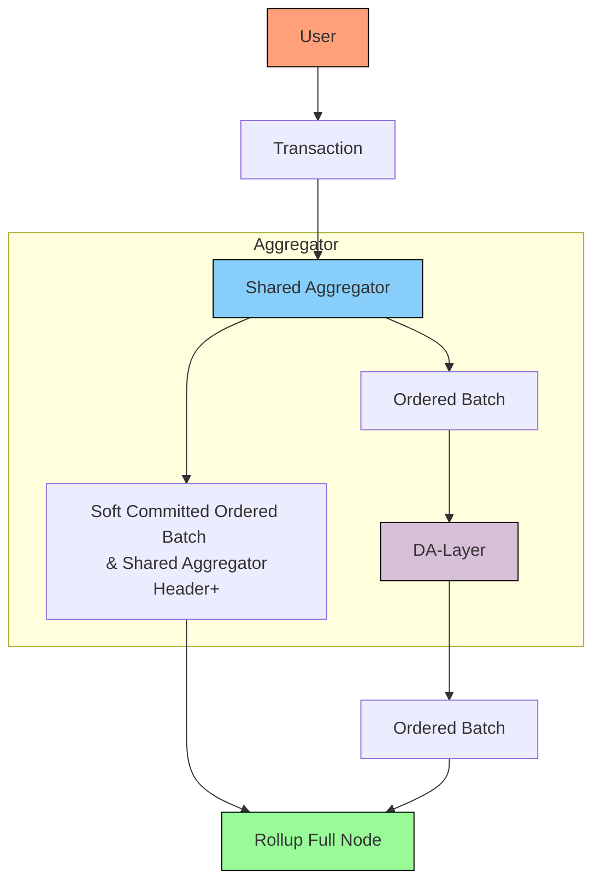

# Pessimistic Rollup with a Shared Sequencer

import ColorSwatch from '../../components/ColorSwatch';

## Description

This is a pessimistic Rollup using a Shared Sequencer. This design follows the Forum Post originating the [Shared Sequencer Design](https://forum.celestia.org/t/sharing-a-sequencer-set-by-separating-execution-from-aggregation/702/9). We assume the only canonical way to order the transactions are through the Shared Sequencer. All transactions have to be ordered by the Shared Sequencer and other batches are ignored.

## Design

Here is an example of what this design could look like:

The Shared Sequencer Aggregates Transactions and posts the ordered Batch to the underlying DA-Layer. 

> To unlock a web2 equivalent UX, the shared sequencers […] can provide fast soft commitments. These soft commitments provide some arbitrary promise of the final ordering of transactions, and can be used to create prematurely updated versions of the state. As soon as the blockdata has been confirmed to be posted on the baselayer, the state can be considered final.
> 

The Shared Sequencer does Inclusion and Ordering.

### Legend

| Component | Color Code |
|:-:|:-:|
| User | <ColorSwatch hexValue="FFA07A" /> |
| Shared Aggregator | <ColorSwatch hexValue="87CEFA" /> |
| DA Layer | <ColorSwatch hexValue="D8BFD8" /> |
| Rollup Full Node | <ColorSwatch hexValue="98FB98" /> |

## Aggregation

The DA-Layer is the Aggregator. It does Inclusion and Ordering.

## Header Production

Each Full Node has to execute all transactions. There are no Light Nodes in this system so there is no need to produce a rollup header.

## Censorship Resistance

Based rollups enjoy the same censorship resistance as the DA-Layer.

## Liveness

Based rollups enjoys the same liveness guarantees as the DA-Layer (Based Rollups).

## Rollup Light Nodes

This design has no Rollup Light Nodes.

## Smallest Trust-Minimized Setup

DA-Layer Light Node + Rollup Full Node

